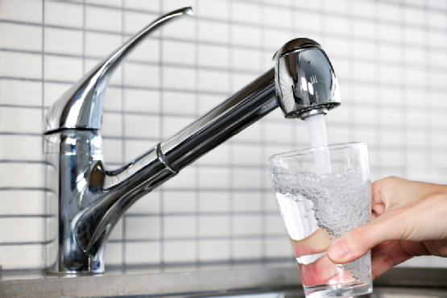
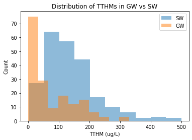
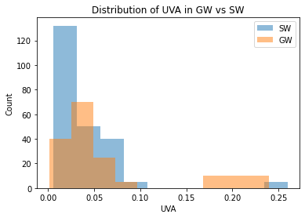
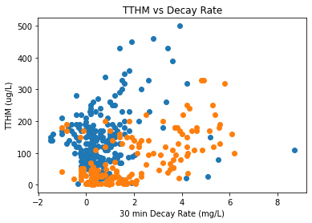
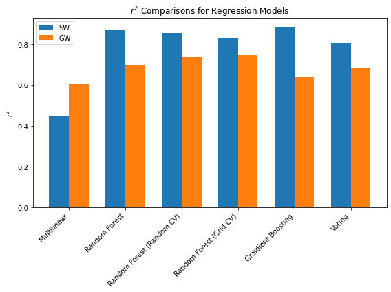
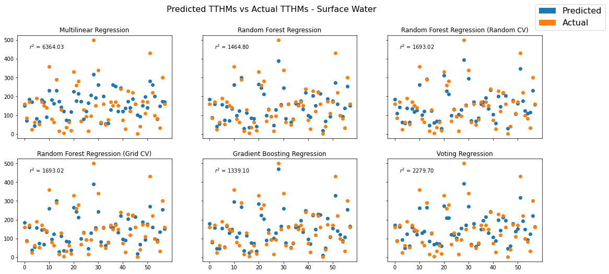
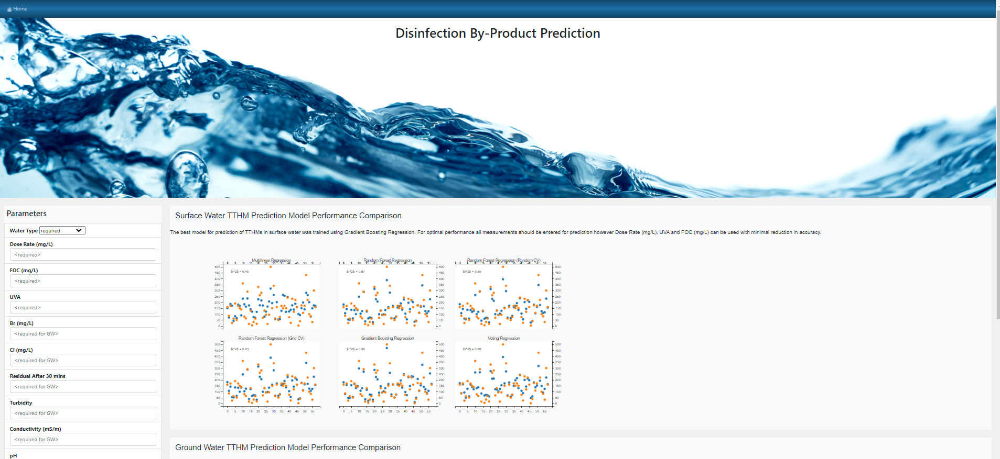
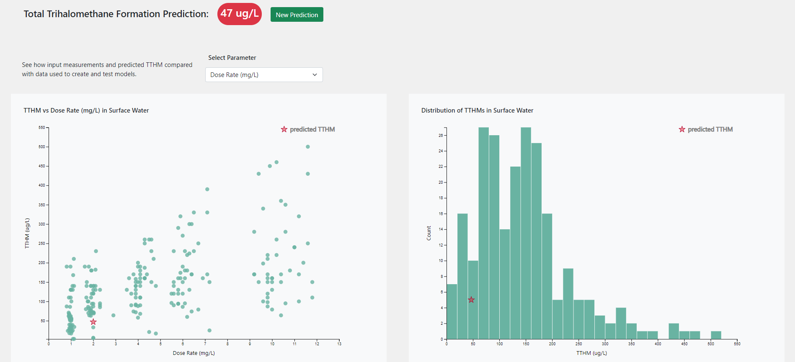

# Disinfection By-Production Formation Prediction



## Introduction

Trihalomethanes (THMs) are a type of disinfection by-product formed when chlorine reacts with natural organic matter in water. Currently the THM 
formation potential of source waters is measured by dosing samples with chlorine and measuring the Total THMs (TTHM) formed after 7 days. This
process is costly and slow. The aim of this project was to develop a model to predict disinfection by-product formation, specifically TTHMs, using a range 
of parameters measured from ground and surface waters and comparing them to disinfection by-product formation potentials that were measured at the same time.

The data used had been collected from several raw water sources over a period of 5 years and was stored in a csv file. The csv file was imported and cleaned using
pandas. Data was split into training and testing groups and modeled using sklearn. Regression modeling was chosen as the target TTHM data is continous not catagorical
and a predicted value on the continum is required. Several regression models were created and compared, the optimal models were exported and deployed using a 
flask app on heroku: https://disinfectionbyproductpredictor.herokuapp.com/


## Structure
```
|__ data/
|
|__ models/
|
|__ static/                 
|   |__ css/                
|   |   |__ d3Style.css             
|   |   |__ style.css               
|   |   
|   |__ data/                       
|   |__ js/
|       |__ app.js                  
|       |__ icon.js                 
|
|__ templates/   
|    |__ data.html                  
|    |__ index.html                 
|
|__ .gitignore
|
|__ app.py                          
|
|__ GW vs SW.ipynb                 
|
|__ Procfile
|
|__ README.md
|
|__ requirements.txt

```

## Usage

```
The page was created using:
- HTML5
- Bootstrap 5.0.2
- Javascript ES6
- D3.js V4
- python 3.8.5
- pandas 1.2.4
- matplotlib 
- mpld3 0.5.5 # used to create html file of interactive matplotlib chart
- joblib 1.0.1
- numpy 1.20.1
- seaborn 0.11.1
- sklearn 0.0
- flask 1.1.2
- gnuicorn
- heroku

```


## Questions

1. Can a model be created to accurated predict the TTHM formation based on available parameters?
2. Which parameters contributed most to TTHM formation based on the selected model?
3. Does the water type (surface or ground) effect the model's accuracy?


## Analysis

Initial data exploration using matplotlib indicated that the ground water and surface water parameters had different 
distributions so were separated for modeling. 








As the parameters were skewed the data was scaled using standard scaling.

Six different regression models were trained on both datasets and the r2 for the test data and mean squared error between the 
predicted and actual TTHMs were compared.





The ground water models overall has lower r2s compared to the surface water models, therefore there was less correlation 
between the parameters and TTHMs. The optimal model was Random Forest Regression using Grid Cross-Validation, the r2 was 0.75 and mean 
squared error was the lowest as 1657 (sqrt = 40). The mean of TTHms in the ground water samples was 74 so the mean squared 
error is significant in comparison. 

The most significant parameters for this model were Dose Rate, 30 minute decay rate and Colour. A trimmed version of the model
using only those parameters was created however the reduction in the r2 was large and only the original model and scaling model
were exported for the heroku app.

The optimal model for surface water was Gradient Boosting Regression, the r2 was 0.88 and mean squared error was the lowest at 1339 (sqrt = 36). 
The mean TTHMs for all surface water samples was 140 so the mean squared error has less of an impact than in the ground water model.

The most significant parameters for this model were Dose Rate, FOC and UVA. A trimmed version of the model using only those parameters was 
created within only a minimal reduction in r2, 0.83. Both models and the scaling model were exported for the heroku app.





The heroku app was deployed here - https://disinfectionbyproductpredictor.herokuapp.com/. The user can input values in the form displayed 
in the landing page. The regression model is selected based on the form inputs, the form data is retrieved into the flask app and scaled using 
the exported scaling model then passed into the selected regression model.








## Conclusion

1. Can a model be created to accurated predict the TTHM formation based on available parameters?

Using regression, the TTHM formation was able to be modeled using the available parameters. The optimal model for surface water was Gradient Boosting 
Regression, and for ground water it was Random Forest Regression using Grid Cross-Validation.

2. Which parameters contributed most to TTHM formation based on the selected model?

In surface waters the Dose Rate, UVA and FOC contributed the most to the model and a trimmed version of the model using only those parameters was
able to be created with minimal reduction in correlation and accuracy. This will allow for predictions to be made faster and more cheaply.

In ground waters the Dose Rate, 30 min decay and colour contributed most to the model however using only those parameters did not produce a model
accurate enough to justify removing them.

3. Does the water type (surface or ground) effect the model's accuracy?

The distribution of parameters were different for surface waters and ground waters therefore TTHMs were modeled separately. In general for all models
the parameters correlated less strongly with TTHMs in ground waters compared to surface waters. The mean squared errors for predicted vs actual TTHMs
were also higher in the ground water samples.


