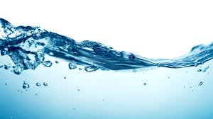

# Disinfection By-Production Formation Prediction



## Introduction

Trihalomethanes (THMs) are a type of disinfection by-product formed when chlorine reacts with natural organic matter in water. Currently the THM 
formation potential of source waters is measured by dosing samples with chlorine and measuring the Total THMs (TTHM) formed after 7 days. This
process is costly and slow. The aim of this project was to develop a model to predict disinfection by-product formation, specifically TTHMs, using a range 
of parameters measured from ground and surface waters and comparing them to disinfection by-product formation potentials that were measured at the same time.

The data used had been collected from several raw water sources over a period of 5 years and was stored in a csv file. The csv file was imported and cleaned using
pandas. 


Data was split into training and testing groups and modeled using sklearn.

Several regression models were created and compared


https://disinfectionbyproductpredictor.herokuapp.com/


## Structure
```
|__ data/
|
|__ models/
|
|__ static/                 
|   |__ css/                
|   |   |__ d3Style.css             
|   |   |__ style.css               
|   |   
|   |__ data/                       
|   |__ js/
|       |__ app.js                  
|       |__ icon.js                 
|
|__ templates/   
|    |__ data.html                  
|    |__ index.html                 
|
|__ .gitignore
|
|__ app.py                          
|
|__ GW vs SW.ipynb                 
|
|__ Procfile
|
|__ README.md
|
|__ requirements.txt

```

## Usage

```
The page was created using:
- HTML5
- Bootstrap 5.0.2
- Javascript ES6
- D3.js V4
- python 3.8.5
- pandas 1.2.4
- matplotlib 
- mpld3 0.5.5 # used to create html file of interactive matplotlib chart
- joblib 1.0.1
- numpy 1.20.1
- seaborn 0.11.1
- sklearn 0.0
- flask 1.1.2
- gnuicorn
- heroku

```

## Analysis

### Question 1: Can a model be created to accurated predict the TTHM formation based on available parameters?
### Question 2: Which parameters contributed most to TTHM formation based on the selected model?
### Question 3: Does the water type (surface or ground) effect the model's accuracy?

Initial data exploration using matplotlib indicated that the ground water and surface water parameters had different 
distributions so were separated for modeling. 


Six different regression models were trained on both datasets and the r2 for the test data were compared.


The ground water models overall has lower r2s compared to the surface water models, therefore there was less correlation 
between the parameters and TTHMs. The optimal model was Random Forest using Grid Cross-Validation, the r2 was 0.75. The
most significant parameters for this model were Dose Rate, 30 minute decay rate and Colour. A trimmed version of the model
using only those parameters was created however the reduction in the r2 was large and only the original model was exported
for the heroku app.

The optimal model for surface water was Gradient Boosting, the r2 was 0.88. The most significant parameters for this model
were Dose Rate, FOC and UVA. A trimmed version of the model using only those parameters was created within only a minimal
reduction in r2, 0.83. Both models were exported for the heroku app.


